# AI 解压小助手

> 原项目文档：[飞书文档](https://sxa0qplsp1j.feishu.cn/docx/IieUd7Rb8o8bJcxgu8FcPct4n1g)
>
> api 文档: [ApiFox](https://apifox.com/apidoc/shared-8da81565-7e10-4bc9-a216-c914d00c2345)

## 项目背景

近些年“内卷”这个词充斥在这个社会，在竞争越发激烈的时代，不管是青少年（小学生、初中生、高中生）、大学生、现代青年人均面临着巨大的压力。青少年的压力来自于年轻家长的学业管理和升学烦恼；大学生的压力来自于就业的烦恼；现代青年人的压力来自于职场的严酷及生活和养育孩子的压力，缺乏情绪支持和积极的建议。

这个项目的核心内容是通过与用户进行对话，提供情绪支持、解决问题和提供积极的建议。通过这个项目，我们希望能够帮助现代青年人更好地应对他们面临的压力和挑战

## 项目亮点

-   通过向量数据库 (Vector Database) 实现 LLM 的超长记忆
-   引入聆听者机制 (Listener Mechanism)，更贴合实际的聊天场景
-   包含父母、闺蜜、朋友和心理医生多种预设聊天角色
-   允许用户通过 Prompt 丰富角色人格
-   提供易用的 Web 应用
-   成熟的完善的 API 文档，方便后续二次开发

## 实现原理

本项目的核心就是使用提示词工程(Prompt Engineering)的技术，让 LLM 生成合适的回答。
提示词主要包括两个部分，与角色风格相关的提示词，以及内容相关的提示词。
前者除了项目相关的提示词这种基本提示词，以及角色预设的提示词赋予 LLM 基本的角色属性，
还包括用户自定义描述，支持用户以提示词的形式丰富角色。

后者除了用户发送的消息之外，还包括最近聊天产生的历史聊天记录，和与用户消息有关的近似聊天记录。
历史聊天记录用于实现基本的上下文对话功能，而近似聊天记录能够拓展 LLM 的记忆范围，
能够找到相关的更久远的记忆。

而对于聆听者机制，我们引入了一个异步计时器。
每当用户输入消息时，都会启动异步计时器计时，并将消息放入消息队列中。
此外，我们还引入了一个计数器，当技术器启动时计数器自增，结束时计数器自减。
直到计数器重新为 0 时，则将消息队列中的所有消息合并发送给 LLM。

合并发送在回答回答生成能够正常运行，但是在持久化存储上，可能会出现前后端不一致的情况。
因为在前端应该为多条消息，但是在后端由于进行合并变为了一条。
为了解决这种问题，我们在合并存储消息时引入分隔符（本项目目前使用`\n\n`），
但获取消息记录时，只需要通过该分隔符分割即可。
值得注意的是，在分隔符的选取上，要选择用户不会输入的符号。

> 由于某些 LLM 的 API 并不支持用户多条输入的调用，因此我们还是选择将消息合并在一起存储。

## 实现技术

本项目采用了前后端分离的方式进行开发，使用的技术栈如下所示。
值得注意的是，由于大多数的 LLM 提供的 SDK 以及向量数据 chroma 只有 python 的版本，
所以我们后端分成了两个部分。
在 golang 部分，主要存放一些业务信息，比如用户的基本信息等。
而在 python 部分，主要是封装了一些关于 LLM 调用和向量数据库使用的一些操作。

-   frontend: Vue, Element, Axios
-   backend:
    -   golang: gin, gorm ,mysql
    -   python: flask, ernie, openai, chroma

> 注意：具体实现请查看其他分支
